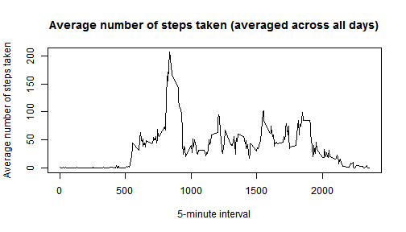

###About the assignment and Data set

This assignment makes use of data from a personal activity monitoring device. This device collects data at 5 minute intervals through out the day. The data consists of two months of data from an anonymous individual collected during the months of October and November, 2012 and include the number of steps taken in 5 minute intervals each day.

The variables included in this dataset are:

a. steps: Number of steps taking in a 5-minute interval (missing values are coded as NA)

b. date: The date on which the measurement was taken in YYYY-MM-DD format

c. interval: Identifier for the 5-minute interval in which measurement was taken

The dataset is stored in a comma-separated-value (CSV) file and there are a total of 17,568 observations in this dataset.

###Loading and preprocessing the data


```r
activity <- read.csv("activity.csv")
activity$date <- as.Date(activity$date)
```

###What is mean total number of steps taken per day?

Count of records excluding the NA cases

```r
library(dplyr)
```
Calculate mean total number of steps taken per day

```r
activity.ignore.na <- na.omit(activity)
nrow(activity.ignore.na)
```

```
## [1] 15264
```

```r
daily.steps <- activity.ignore.na %>% group_by(date) %>% summarize(steps=sum(steps))
```
Make a histogram of the total number of steps taken each day

```r
hist(daily.steps$steps,main="Total Number of Steps Taken Daily",breaks=10,xlab="Steps")
```

 

Calculate and report the mean and median of the total number of steps taken per day

**_Calculated Mean is 10766.19 and Median is 10765 _**

###What is the average daily activity pattern?

Calculate average steps for each of 5-minute interval during a 24-hour period

```r
time.average <- activity.ignore.na %>% group_by(interval) %>% summarize(steps=mean(steps))
```

Make a time series plot of the 5-minute interval and the average number of steps taken, averaged across all days


```r
plot(
  time.average$interval,
  time.average$steps,
  type="l",
  xlab="5-minute interval",
  ylab="Average number of steps taken",
  main="Average number of steps taken (averaged across all days)"
)
```

 

Which 5-minute interval, on average across all the days in the dataset, contains the maximum number of steps?


```r
maxsteps <- time.average %>% filter(steps==max(steps))
```


```
##   interval    steps
## 1      835 206.1698
```

**Observations:** _Based on steps taken pattern, the person's daily activity peaks around **8:35 am**._

###Imputing missing values

Calculate and report the total number of missing values in the dataset (i.e. the total number of rows with NAs)


```r
nrow(activity[is.na(activity$steps),])
```

```
## [1] 2304
```

Strategy for filling in all of the missing values - "NA"s replaced with mean for that 5-minute interval
Create a new dataset that is equal to the original dataset but with the missing data filled in

NA cases populated 

```r
NACases <- activity[is.na(activity$steps),] %>% 
  select(date, interval) %>% 
  merge(time.average,by="interval") %>%  
  select(steps,date,interval)
NACases$steps <- as.integer(NACases$steps)
```

Populated NA cases merged with good data


```r
activity.recon <- rbind(activity.ignore.na,NACases)
```

Make a histogram of the total number of steps taken each day.


```r
daily.steps.recon <- activity.recon %>% group_by(date) %>% summarize(steps=sum(steps))
hist(daily.steps.recon$steps,main="Total Number of Steps Taken Daily",breaks=10,xlab="Steps")
```

 

Calculate and report the mean and median total number of steps taken per day.


```r
meansteps.recon <- round(mean(daily.steps.recon$steps),2)
mediansteps.recon <- median(daily.steps.recon$steps)
```

**_Calculated Mean is 10749.77 and Median is 10641 _**

**Observation :** _Mean appears to be almost same as before but the Median has dropped by over 100 points_ 

###Are there differences in activity patterns between weekdays and weekends?

Use the dataset with the filled-in missing values for this part

Create a new factor variable in the dataset with two levels - "weekday" and "weekend" indicating whether a given date is a weekday or weekend day.


```r
activity.recon.wday <- mutate(activity.recon, 
        weekday = as.factor(ifelse(weekdays(date) %in% c("Saturday","Sunday"),"Weekend", "Weekday")))
```

Make a panel plot containing a time series plot (i.e. type = "l") of the 5-minute interval (x-axis) and the average number of steps taken, averaged across all weekday days or weekend days (y-axis)


```r
time.average.wday <- activity.recon.wday %>% group_by(weekday,interval) %>% summarize(steps=mean(steps))
library(ggplot2)
g <- ggplot(time.average.wday, aes(x=interval, y=steps)) +
  geom_line() + 
  facet_grid(weekday~.) +
  theme_bw() +
  geom_line(stat="hline", yintercept="median",linetype="dashed",color="red",size=1.5) +
  labs(x="5-minute interval",y="Average number of steps taken") +
  labs(title="Average number of steps taken across Weekdays / Weekends")
print(g)
```

 


**Observations :**

_1. Weekends steps starts to grow up later hours compared to Weekdays_

_2. Average peak step in Weekdays 230.36 is more than average peak step in Weekends 166.62_

_3. Weekend Median 32.31 is higher than Weekday Median of 25.7_
